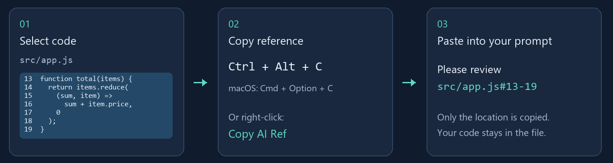
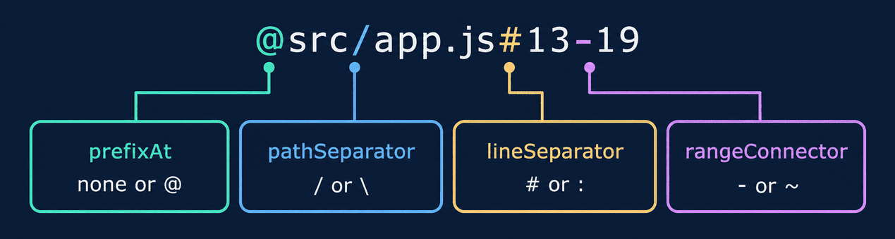

# Copy AI Ref

**Copy file paths and line ranges in one keystroke. Give your AI coding assistant the exact place to look.**

Select code → press **Ctrl+Alt+C** (macOS: **Cmd+Option+C**) → paste `src/app.js#13-19` into your prompt.



Unlike copying a relative path alone, Copy AI Ref includes your cursor line or selected line range. It copies **references, not code content**. No API key, account, runtime dependencies, or per-project setup. The extension makes no network requests and collects no telemetry.

## Quick start

1. Install [Copy AI Ref](https://marketplace.visualstudio.com/items?itemName=lentice.copy-ai-ref-lentice) from VS Code's Extensions view.
2. Open a local file and select code, or place the cursor on a line.
3. Press **Ctrl+Alt+C** / **Cmd+Option+C**, or right-click → **Copy AI Ref**.
4. Paste into your AI prompt. A brief status-bar message confirms the copy.

Your assistant must be able to access the referenced project. Pasting a reference does not upload or attach the file. Relative paths assume the assistant is working from the corresponding workspace folder; use absolute paths when its working directory differs.

## What gets copied

| Action | Output with default settings |
|---|---|
| Cursor on line 13 | `src/app.js#13` |
| Select lines 13–19 | `src/app.js#13-19` |
| Multiple cursors or selections | One reference per selection, sorted by position, duplicates removed |
| Select files in Explorer | One file path per line, without line numbers |
| Copy an absolute reference | `C:/project/src/app.js#13-19` on Windows, `/home/you/project/src/app.js#13-19` on Linux |

For example, two selections produce:

```text
src/app.js#13-19
src/app.js#42
```

For a one-off absolute path in your configured format, run **Copy AI Ref (Absolute Path)**.

## Copy whole-file references from Explorer

Select one or more files in the Explorer, then right-click:

- **Copy AI Ref** — copy file paths using your settings.
- **Copy AI Ref (Absolute Path)** — copy absolute file paths.

Files do not need to be open. References follow the Explorer's supplied selection order, one per line, with no line numbers. The `prefixAt` setting also applies to file references. Selections containing folders show a warning and leave the clipboard untouched.

## Keyboard shortcut

| Platform | Copy AI Ref (editor focused) |
|---|---|
| Windows / Linux | `Ctrl+Alt+C` |
| macOS | `Cmd+Option+C` |

To change a shortcut or resolve a conflict, open **Preferences: Open Keyboard Shortcuts** and search for **Copy AI Ref**. The absolute-path command can be bound independently. Explorer commands are available through its right-click menu.

## Settings

Search for **Copy AI Ref** in Settings.

One example, **`@src/app.js#13-19`**, shows which part each setting controls:



Defaults: `prefixAt: none`, `pathSeparator: slash`, `lineSeparator: #`, `rangeConnector: dash`. The example above enables `prefixAt: @`.

**Path mode:** `copyAiRef.pathMode` chooses `relative` (default, `src/app.js`) or `absolute` (`C:/project/src/app.js`) for both editor and Explorer references.

## Path and selection details

- A selection ending at the start of the next line excludes that next line.
- Relative paths use the containing workspace folder, without its display name. Files outside the workspace, or files opened without a workspace, fall back to absolute paths.
- In multi-root workspaces, relative paths can be ambiguous when different roots contain the same path. Choose absolute paths to distinguish them.
- Only `file:` resources are supported. Untitled documents, virtual documents, and remote URI schemes are not supported. Save untitled files locally before copying.
- References describe the editor's current line positions. Save changes before asking an assistant that reads from disk to inspect them.
- Unrecognized setting values fall back to their defaults. Copy failures show an error instead of a success message.

## Local installation and maintenance

For a local package, use **Extensions: Install from VSIX**.

Run `node test.js` to check reference formatting and command behavior with a mocked VS Code API. Before release, verify editor and Explorer right-click menus, multi-file selection, absolute paths, and platform shortcuts in VS Code.

## License

[MIT](LICENSE)
